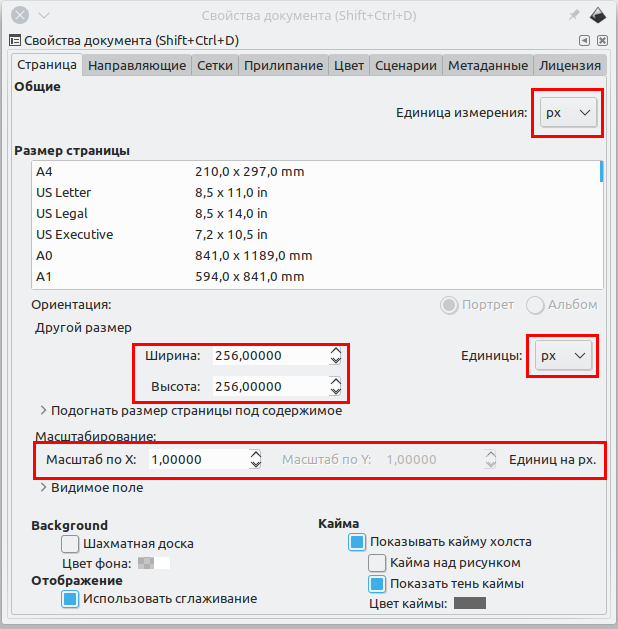

# Заметки по подготовке иконочного ширфта из svg-файлов

1. Все файлы необходимо привести в один размер холста
    1. Открыть свойства документа.
    2. Выставить единицы измерения px
    3. Выставить размер холста 256x256 для квадратных иконок
    4. Выставить масштаб 1.0
    5. Для прямоугольных вертикальных иконок большую сторону (высоту)
       холста выставляем в 256px, а вторую (ширину) пропорционально размеру.
       Лучше сначала масштабировать сам объект,
       а потом по его размеру выставить размер холста
    6. Для прямоугольных горизонтальных иконок холст квадратным 256x256px,
       ширину иконки выставляем в 256px, высоту - масштабируем
       и иконку выравниваем по центу холста.

2. Само изображение должно быть единой кривой (Path)
3. Если на изображении есть тонкие пути с толстым stroke-ом,
   то его конвертируем в путь.
   Меню -> Контур -> Оконтурить обводку (Ctrl + Alt + C)
4. Если у насть есть два объекта (кривых), их необходимо объединить в один.
   Выделяем оба через Shift и жмем Ctrl+"+" (Ctrl + Shift + "=");
   1. Иногда нужно вырезать один из другого (Ctrl + "-")
   
